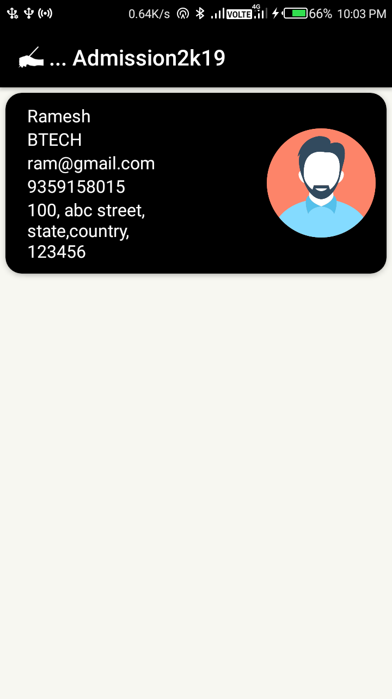
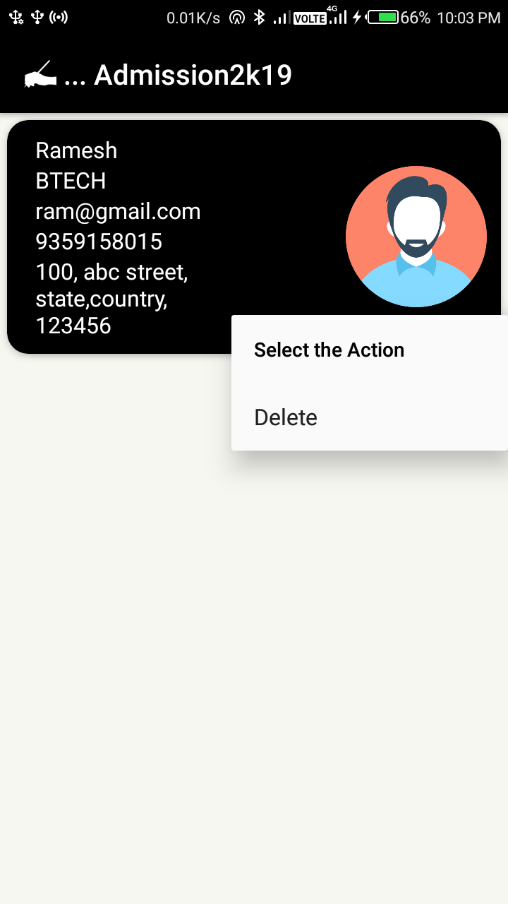

# Admission2k19-android
An Android App which receive the data from a website via firebase.
[get website source code](https://github.com/deorabanna1925/Admission2k19-website)

## Website

## App
<table style="width:100%">
    <tr>
    <td></td>
    <td></td> 
    <td></td>
  </tr>
</table>
